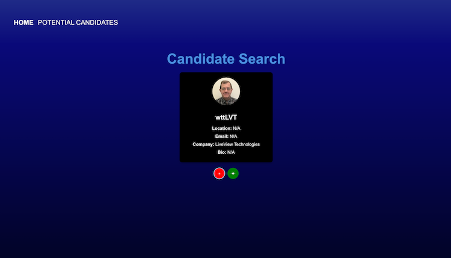
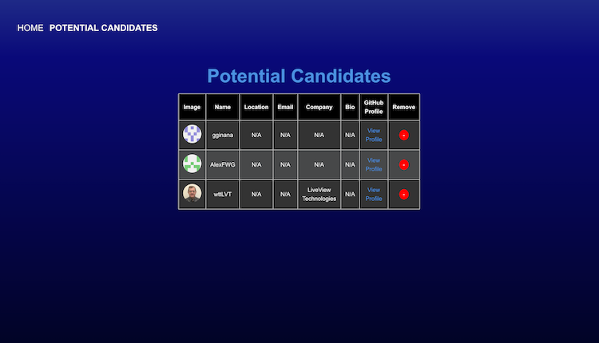

# Candidate Search Application

## Description

The Candidate Search Application allows users to browse potential candidates by fetching data from the **GitHub API**. The app displays relevant candidate information, such as their name, avatar, location, email, and company. Users can:
- Save candidates to a "Potential Candidates" list.
- Skip candidates to view the next one.
- Manage and view the saved candidates list.

### Key Features:
- Displays one candidate at a time with their profile details.
- Save candidates to a "Potential Candidates" list for later review.
- Remove candidates from the saved list.
- Data persistence using `localStorage`.
- Responsive and clean user interface.

---
## Description
- Deployed Application: https://candidatesearch-cjlk.onrender.com

## Screenshots

### Candidate Search Page

### Saved Candidates Page

---

## Technologies Used

- **React** with **TypeScript**
- **CSS** for styling and responsiveness
- **LocalStorage** for data persistence
- **Render** for deployment

---
